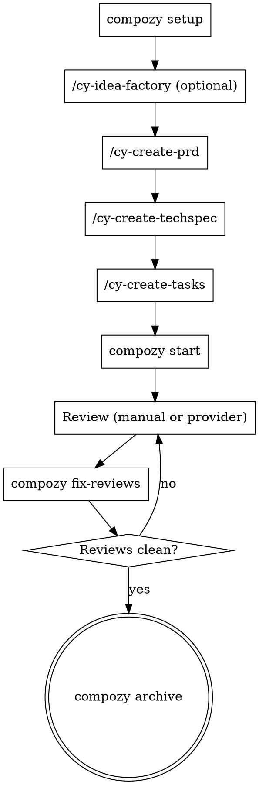

# Compozy Reference Guide

Comprehensive reference for the Compozy CLI and its AI-assisted development workflow.

## What Is Compozy

Compozy is a Go CLI that orchestrates the full lifecycle of AI-assisted development. It covers product ideation, technical specification, task decomposition, automated execution via AI coding agents, and PR review remediation.

Key characteristics:

- **Agent-agnostic.** Supports claude, codex, copilot, cursor-agent, droid, gemini, opencode, and pi as ACP runtimes.
- **Skills-based.** Bundled skills (installed via `compozy setup`) teach agents how to execute each workflow phase.
- **Artifact-driven.** All workflow state lives in markdown files under `.compozy/tasks/<slug>/`, versioned alongside the codebase.
- **Single binary, local-first.** No sidecars, no external control planes.

## Workflow Pipeline Overview

The standard development pipeline follows these phases in order. Each phase produces artifacts consumed by the next.

1. **Setup** -- `compozy setup` installs core skills into target agents plus any setup assets shipped by enabled extensions.
2. **Ideation** (optional) -- install and enable the first-party `cy-idea-factory` extension, run `compozy setup`, then use `/cy-idea-factory` to expand a raw idea into a structured, research-backed spec at `.compozy/tasks/<slug>/_idea.md`.
3. **Requirements** -- `/cy-create-prd` creates a business-focused Product Requirements Document at `.compozy/tasks/<slug>/_prd.md` with ADRs.
4. **Technical Design** -- `/cy-create-techspec` translates the PRD into a technical specification at `.compozy/tasks/<slug>/_techspec.md` with ADRs.
5. **Task Decomposition** -- `/cy-create-tasks` breaks down the PRD and TechSpec into independently implementable task files (`task_01.md`, `task_02.md`, etc.) and a master list at `_tasks.md`.
6. **Execution** -- `compozy start --name <slug> --ide <runtime>` dispatches task files sequentially to the configured AI agent for implementation.
7. **Review** -- `/cy-review-round` (manual AI review) or `compozy fetch-reviews --provider coderabbit --pr <N>` (external provider) produces review issue files under `reviews-NNN/`.
8. **Remediation** -- `compozy fix-reviews --name <slug>` processes review issues, triages, fixes, and verifies each one.
9. **Archive** -- `compozy archive --name <slug>` moves fully completed workflows to `.compozy/tasks/_archived/`.

Repeat phases 7-8 until the review is clean, then merge.



For a detailed step-by-step walkthrough of each phase, read `references/workflow-guide.md`.

## CLI Commands Quick Reference

| Command | Purpose | Key Flags |
| --- | --- | --- |
| **Setup & Config** | | |
| `compozy setup` | Install core skills and enabled extension assets | `--agent`, `--skill`, `--global`, `--copy`, `--list`, `--all`, `--yes` |
| `compozy upgrade` | Update CLI to latest release | |
| **Workflow Execution** | | |
| `compozy start` | Execute PRD task files sequentially | `--name`, `--ide`, `--model`, `--auto-commit`, `--dry-run` |
| `compozy exec` | Execute an ad hoc prompt | `--agent`, `--format`, `--prompt-file`, `--tui`, `--persist`, `--run-id` |
| **Review** | | |
| `compozy fetch-reviews` | Fetch provider review comments | `--provider`, `--pr`, `--name`, `--round` |
| `compozy fix-reviews` | Process review issue files | `--name`, `--round`, `--concurrent`, `--batch-size`, `--ide` |
| **Utilities** | | |
| `compozy validate-tasks` | Validate task file metadata | `--name`, `--tasks-dir`, `--format` |
| `compozy sync` | Refresh task workflow metadata | `--name`, `--root-dir`, `--tasks-dir` |
| `compozy archive` | Move completed workflows to archive | `--name`, `--root-dir`, `--tasks-dir` |
| `compozy migrate` | Convert legacy artifacts to frontmatter | `--name`, `--dry-run`, `--reviews-dir` |
| **Agent Management** | | |
| `compozy agents list` | List resolved reusable agents | |
| `compozy agents inspect` | View agent definition and defaults | `<name>` |
| **Extensions** | | |
| `compozy ext list` | List extensions | |
| `compozy ext inspect` | View extension details | `<name>` |
| `compozy ext install` | Install an extension from a local path or GitHub repo archive | `<source>`, `--remote`, `--ref`, `--subdir` |
| `compozy ext uninstall` | Remove an extension | `<name>` |
| `compozy ext enable/disable` | Toggle extension | `<name>` |
| `compozy ext doctor` | Diagnose extension issues | |

Common flags shared by `start`, `exec`, and `fix-reviews`: `--ide`, `--model`, `--reasoning-effort`, `--add-dir`, `--auto-commit`, `--dry-run`.

For complete flag documentation, read `references/cli-reference.md`.

## Core Skills Summary

| Skill | Trigger | When To Use | Do Not Use For |
| --- | --- | --- | --- |
| `cy-create-prd` | `/cy-create-prd` | Building a Product Requirements Document | TechSpec, task breakdown, coding |
| `cy-create-techspec` | `/cy-create-techspec` | Translating PRD into technical design | PRD creation, task execution |
| `cy-create-tasks` | `/cy-create-tasks` | Decomposing PRD+TechSpec into task files | Execution, review |
| `cy-execute-task` | (internal) | Executing a single PRD task (called by `compozy start`) | Direct invocation, review work |
| `cy-review-round` | `/cy-review-round` | Performing comprehensive code review | Fetching external reviews, fixing |
| `cy-fix-reviews` | (internal) | Remediating review issues (called by `compozy fix-reviews`) | Fetching reviews, task execution |
| `cy-final-verify` | `/cy-final-verify` | Enforcing verification before completion claims | Early planning, brainstorming |
| `cy-workflow-memory` | (internal) | Maintaining cross-task workflow memory | PR reviews, user preferences |
| `compozy` | `/compozy` | Learning how to use Compozy | Executing workflow steps |

## Optional Extension Skills

| Skill | Trigger | When To Use | Install Flow |
| --- | --- | --- | --- |
| `cy-idea-factory` | `/cy-idea-factory` | Raw feature idea needs structured exploration before a PRD | `compozy ext install --yes compozy/compozy --remote github --ref <tag> --subdir extensions/cy-idea-factory` -> `compozy ext enable cy-idea-factory` -> `compozy setup` |

For detailed skill descriptions and inputs/outputs, read `references/skills-reference.md`.

## Artifact Directory Structure

```
.compozy/
  config.toml                          # Workspace configuration
  tasks/
    <slug>/                            # One directory per workflow
      _idea.md                         # Idea spec (from cy-idea-factory)
      _prd.md                          # Product Requirements Document
      _techspec.md                     # Technical Specification
      _tasks.md                        # Master task list
      _meta.md                         # Workflow metadata
      task_01.md ... task_N.md         # Individual task files
      adrs/
        adr-001.md ... adr-NNN.md      # Architecture Decision Records
      reviews-NNN/
        _meta.md                       # Review round metadata
        issue_001.md ... issue_N.md    # Review issue files
      memory/
        MEMORY.md                      # Shared workflow memory
        task_01.md ... task_N.md       # Per-task memory
    _archived/
      <timestamp>-<slug>/             # Archived completed workflows
  runs/
    <run-id>/                          # Persisted exec session artifacts
  agents/
    <name>/                            # Workspace-scoped reusable agents
      AGENT.md                         # Agent definition
      mcp.json                         # Optional MCP server config
  extensions/                          # Workspace-scoped extensions
```

Global paths:
- `~/.compozy/agents/<name>/` -- global reusable agents (workspace overrides global)
- `~/.compozy/extensions/` -- user-scoped extensions

## Configuration

Workspace defaults live in `.compozy/config.toml`. CLI flags always override config values.

```toml
[defaults]
ide = "claude"
model = "opus"
auto_commit = true
reasoning_effort = "high"
add_dirs = ["../shared-lib"]

[start]
include_completed = false

[tasks]
types = ["frontend", "backend", "docs", "test", "infra", "refactor", "chore", "bugfix"]

[fix_reviews]
concurrent = 2
batch_size = 3

[fetch_reviews]
provider = "coderabbit"
nitpicks = false

[exec]
verbose = false
tui = false
persist = false
```

For all fields, types, and defaults, read `references/config-reference.md`.

## Reusable Agents and the Council Pattern

Reusable agents are standalone personas that can be invoked via `compozy exec --agent <name>` or referenced by skills through `run_agent`.

**Discovery order:** workspace (`.compozy/agents/<name>/`) overrides global (`~/.compozy/agents/<name>/`).

**Agent definition:** Each agent has an `AGENT.md` with YAML frontmatter (`title`, `description`) and optional `mcp.json` for MCP server configuration.

**Council agents shipped by the optional `cy-idea-factory` extension**:

| Agent | Perspective |
| --- | --- |
| `pragmatic-engineer` | Execution-focused, delivery speed, maintenance burden |
| `architect-advisor` | Long-term system coherence, boundaries, coupling |
| `security-advocate` | Attack vectors, compliance, data protection |
| `product-mind` | User impact, business value, opportunity cost |
| `devils-advocate` | Challenges assumptions, surfaces risks, stress-tests |
| `the-thinker` | Cross-domain patterns, structural reframing |

Install flow: `compozy ext install --yes compozy/compozy --remote github --ref <tag> --subdir extensions/cy-idea-factory` -> `compozy ext enable cy-idea-factory` -> `compozy setup`.

The `cy-idea-factory` skill uses these agents in a council debate to challenge feature scope and surface risks. The `council` skill can also orchestrate multi-advisor debates on demand.

Management commands: `compozy agents list`, `compozy agents inspect <name>`.

## Extensions

Executable plugins that extend Compozy at runtime via JSON-RPC 2.0 on stdin/stdout.

- **Three scopes:** bundled (shipped with Compozy), user (`~/.compozy/extensions/`), workspace (`.compozy/extensions/`). Workspace overrides user overrides bundled.
- **Disabled by default.** Enable explicitly with `compozy ext enable <name>` or `--extensions` flag on `exec`.
- **Capabilities:** lifecycle observation, prompt decoration, plan injection, agent session modification, review provider registration.
- **SDKs:** TypeScript (`@compozy/extension-sdk`), Go (`sdk/extension`).
- **Scaffolding:** `npx @compozy/create-extension` generates extension boilerplate.

Management: `compozy ext list`, `compozy ext inspect <name>`, `compozy ext install <source>`, `compozy ext uninstall <name>`, `compozy ext enable/disable <name>`, `compozy ext doctor`.

## Common Patterns

- Run `compozy setup` before starting any workflow to ensure core skills and enabled extension assets are installed.
- Follow the pipeline in order: idea (optional) -> PRD -> TechSpec -> Tasks -> Start -> Review -> Fix.
- Configure workspace defaults in `.compozy/config.toml` to reduce repetitive CLI flags.
- Run `compozy validate-tasks --name <slug>` before `compozy start` to catch metadata issues early.
- Use `compozy archive` to clean up fully completed workflows and keep the tasks directory focused.
- Use `compozy exec --agent <name>` for ad hoc prompts with a specific advisor perspective.
- Use `compozy exec --persist` to save session artifacts for later resumption with `--run-id`.

## Anti-Patterns

- **Skipping pipeline stages.** Running `compozy start` without a PRD and task files produces poor results.
- **Invoking `cy-execute-task` directly.** Use `compozy start`, which handles dispatch, sequencing, memory, and tracking.
- **Mixing workflow skills out of order.** Running `/cy-create-tasks` without a PRD and TechSpec leads to shallow task decomposition.
- **Editing task file frontmatter manually.** Use `compozy migrate` or `compozy validate-tasks` to fix metadata issues programmatically.
- **Confusing skills with CLI commands.** Skills (slash commands like `/cy-create-prd`) run inside an agent session. CLI commands (`compozy start`) run in the terminal.
- **Skipping verification.** Always use `cy-final-verify` before claiming task completion or creating commits.
