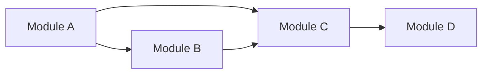

# Refactoring Report Template

Use this template to generate the output document. Save to:
`docs/_refacs/<YYYYMMDD>-<slug>.md`

Replace all `{{placeholders}}` with actual values. Remove sections that don't apply.

---

BEGIN TEMPLATE:

```markdown
# Refactoring Analysis: {{project-or-module-name}}

> **Date**: {{YYYY-MM-DD}}
> **Scope**: {{description of what was analyzed — directory, module, feature area}}
> **Analyzed by**: AI-assisted refactoring analysis (Martin Fowler's catalog)
> **Language/Stack**: {{e.g., TypeScript, React, Node.js}}
> **Test Coverage**: {{known / unknown / none — flag risk if none}}

---

## Executive Summary

{{2-4 sentences summarizing the overall health of the analyzed code and the most
impactful findings. Lead with the biggest opportunity.}}

| Severity | Count |
|----------|-------|
| 🔴 Critical (P0) | {{n}} |
| 🟠 High (P1) | {{n}} |
| 🟡 Medium (P2) | {{n}} |
| 🔵 Low (P3) | {{n}} |
| **Total** | **{{n}}** |

### Top Opportunities (Quick Wins + High Impact)

| # | Finding | Location | Effort | Impact |
|---|---------|----------|--------|--------|
| 1 | {{title}} | `{{file:line}}` | {{trivial/moderate/significant}} | {{description}} |
| 2 | {{title}} | `{{file:line}}` | {{trivial/moderate/significant}} | {{description}} |
| 3 | {{title}} | `{{file:line}}` | {{trivial/moderate/significant}} | {{description}} |

---

## Findings

### P0 — Critical

{{Repeat the finding block below for each P0 finding. Remove this section if no P0.}}

#### F{{number}}: {{Finding Title}}

- **Smell**: {{smell name from catalog — e.g., Duplicated Code, Feature Envy}}
- **Category**: {{Bloater / Change Preventer / Dispensable / Coupler / Conditional Complexity / DRY Violation}}
- **Location**: `{{file_path}}:{{start_line}}-{{end_line}}`
- **Severity**: 🔴 Critical
- **Impact**: {{What maintenance/readability/change-cost problem does this cause?}}

**Current Code** (simplified):
```{{language}}
{{relevant code snippet — keep to essential lines, max 20 lines}}
```

**Recommended Refactoring**: {{technique name — e.g., Extract Function, Introduce Parameter Object}}

**After** (proposed):
```{{language}}
{{refactored code sketch — showing the structural change, not a complete implementation}}
```

**Rationale**: {{Why this refactoring? What does it improve? Reference Fowler if relevant.}}

---

### P1 — High

{{Same finding block structure as P0. Remove if no P1.}}

#### F{{number}}: {{Finding Title}}

- **Smell**: {{smell name}}
- **Category**: {{category}}
- **Location**: `{{file_path}}:{{start_line}}-{{end_line}}`
- **Severity**: 🟠 High
- **Impact**: {{description}}

**Current Code** (simplified):
```{{language}}
{{code snippet}}
```

**Recommended Refactoring**: {{technique}}

**After** (proposed):
```{{language}}
{{refactored sketch}}
```

**Rationale**: {{explanation}}

---

### P2 — Medium

{{Same finding block structure. Remove if no P2.}}

#### F{{number}}: {{Finding Title}}

- **Smell**: {{smell name}}
- **Category**: {{category}}
- **Location**: `{{file_path}}:{{start_line}}-{{end_line}}`
- **Severity**: 🟡 Medium
- **Impact**: {{description}}

**Current Code** (simplified):
```{{language}}
{{code snippet}}
```

**Recommended Refactoring**: {{technique}}

**After** (proposed):
```{{language}}
{{refactored sketch}}
```

**Rationale**: {{explanation}}

---

### P3 — Low

{{For P3, a condensed table format is acceptable instead of full finding blocks.}}

| # | Smell | Location | Technique | Notes |
|---|-------|----------|-----------|-------|
| F{{n}} | {{smell}} | `{{file:line}}` | {{technique}} | {{brief note}} |

---

## Coupling Analysis

### Module Dependency Map

{{Describe the coupling structure. If helpful, include a Mermaid diagram:}}



### High-Risk Coupling

| Module | Afferent (dependents) | Efferent (dependencies) | Risk |
|--------|----------------------|------------------------|------|
| {{module}} | {{n}} | {{n}} | {{high/medium/low}} |

### Circular Dependencies

{{List any circular dependency chains found, or "None detected."}}

---

## DRY Analysis

### Duplicated Code Clusters

| Cluster | Locations | Lines | Extraction Strategy |
|---------|-----------|-------|-------------------|
| {{description}} | `{{file1:lines}}`, `{{file2:lines}}` | {{n}} | {{strategy}} |

### Magic Values

| Value | Occurrences | Suggested Constant Name | Files |
|-------|-------------|------------------------|-------|
| {{value}} | {{n}} | `{{CONSTANT_NAME}}` | {{files}} |

### Repeated Patterns

{{Describe any repeated parameter groups, similar function signatures, or
copy-paste variations found.}}

---

## SOLID Analysis

{{Include this section only if the project uses DDD/hexagonal/clean architecture.
Otherwise, include the "Skipped" note from references/solid-ddd-context.md.}}

> **Context**: {{architectural context}}

| Principle | Finding | Location | Severity | Recommendation |
|-----------|---------|----------|----------|----------------|
| {{S/O/L/I/D}} | {{finding}} | `{{location}}` | {{severity}} | {{recommendation}} |

---

## Suggested Refactoring Order

Recommended sequence based on impact, effort, and dependency between refactorings:

### Phase 1: Quick Wins (trivial effort, immediate clarity)
1. {{action}} — `{{location}}`
2. {{action}} — `{{location}}`

### Phase 2: High-Impact Structural Changes
1. {{action}} — `{{location}}`
2. {{action}} — `{{location}}`

### Phase 3: Deeper Architectural Improvements
1. {{action}} — `{{location}}`

### Prerequisites
- {{Any test coverage needed before refactoring}}
- {{Any dependencies between refactorings — "do X before Y"}}

---

## Risks and Caveats

- {{Note any areas where the current structure might be intentional}}
- {{Flag if test coverage is insufficient for safe refactoring}}
- {{Note any ambiguous findings marked as "potential"}}
- {{Acknowledge framework constraints that limit refactoring options}}

---

## Appendix: Smell Distribution

| Category | Count | % |
|----------|-------|---|
| Bloaters | {{n}} | {} |
| Dispensables | {{n}} | {} |
| Conditional Complexity | {{n}} | {} |
| SOLID Violations | {{n}} | {{%}} |
| **Total** | **{{n}}** | **100%** |
```

END TEMPLATE
