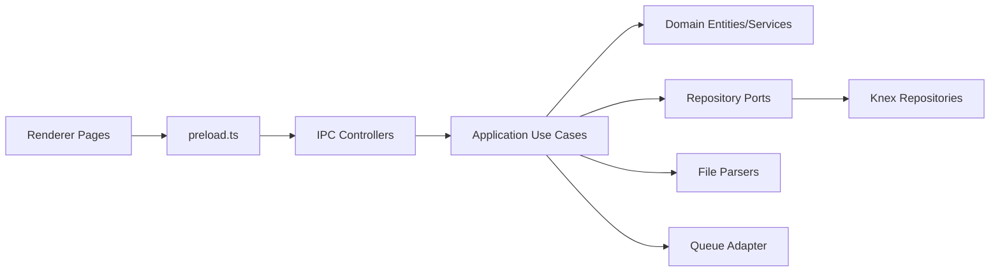

# Refactoring Analysis: tax-report

> **Date**: 2026-04-22
> **Scope**: High-level refactoring scan with focused sampling of `src/main`, `src/renderer`, `src/preload.ts`, and IPC/controller boundaries
> **Analyzed by**: AI-assisted refactoring analysis (Martin Fowler's catalog)
> **Language/Stack**: TypeScript, Electron, React, Knex, Zod
> **Test Coverage**: Known. Repository guidelines state global Jest coverage thresholds of 80% for branches, functions, lines, and statements.

---

## Executive Summary

The codebase already has useful architectural boundaries: domain entities, use cases, repositories, IPC controllers, and a typed preload bridge. The biggest quality issue is not missing structure but repeated orchestration logic spread across adjacent layers, which raises change cost for imports, broker flows, and year-based portfolio operations. The most valuable next step is to consolidate duplicated validation and transport concerns, then split the largest domain/parser/UI modules into smaller units with tighter responsibilities.

| Severity | Count |
|----------|-------|
| 🔴 Critical (P0) | 0 |
| 🟠 High (P1) | 4 |
| 🟡 Medium (P2) | 3 |
| 🔵 Low (P3) | 2 |
| **Total** | **9** |

### Top Opportunities (Quick Wins + High Impact)

| # | Finding | Location | Effort | Impact |
|---|---------|----------|--------|--------|
| 1 | Split parser orchestration from row normalization and mapping | `src/main/infrastructure/parsers/csv-xlsx-transaction.parser.ts:42` | moderate | Reduces change risk in import mapping, broker resolution, and template evolution |
| 2 | Break down `AssetPosition` mutation logic into smaller domain operations | `src/main/domain/portfolio/entities/asset-position.entity.ts:71` | significant | Lowers cognitive load in the most central portfolio aggregate |
| 3 | Extract shared IPC request parsing/handler registration | `src/main/ipc/controllers/portfolio.controller.ts:11`, `import.controller.ts:7`, `report.controller.ts:5` | trivial | Eliminates repeated transport boilerplate and inconsistent error semantics |
| 4 | Pull async state and form logic out of large renderer pages | `src/renderer/pages/BrokersPage.tsx:7`, `ImportPage.tsx:30`, `InitialBalancePage.tsx:11` | moderate | Simplifies UI maintenance and reduces repeated error/loading handling |

---

## Findings

### P1 — High

#### F1: `AssetPosition` mixes multiple mutation policies and persistence-facing state shape

- **Smell**: Large Class / Duplicated Code
- **Category**: Bloater
- **Location**: `src/main/domain/portfolio/entities/asset-position.entity.ts:71-323`
- **Severity**: 🟠 High
- **Impact**: One file owns quantity mutation, broker allocation mutation, year validation, aggregate invariants, and split/reverse-split algorithms. Any new portfolio event increases risk of regressions in a central aggregate.

**Current Code** (simplified):
```ts
applySplit(input: ApplySplitInput): void {
  if (input.ratio <= 0) throw new Error(...);
  for (const [brokerId, quantity] of this._brokerBreakdown.entries()) {
    const nextBrokerQty = Math.floor(quantity * input.ratio);
    if (nextBrokerQty > 0) this._brokerBreakdown.set(brokerId, nextBrokerQty);
    else this._brokerBreakdown.delete(brokerId);
  }
  const nextTotalQuantity = this.calculateTotalQuantity();
  const nextAveragePrice =
    this.averagePriceService.calculateAfterQuantityChange(this, nextTotalQuantity);
  this._totalQuantity = nextTotalQuantity;
  this._averagePrice = nextAveragePrice;
  this.validate();
}
```

**Recommended Refactoring**: Extract Class, Extract Function, Replace Primitive with Object

**After** (proposed):
```ts
class BrokerBreakdown {
  applyRatio(transform: (qty: number) => number): void { ... }
  increment(brokerId: Uuid, quantity: Quantity): void { ... }
  decrement(brokerId: Uuid, quantity: Quantity): void { ... }
  total(): Quantity { ... }
}

class AssetPosition {
  applySplit(ratio: SplitRatio): void {
    this.brokerBreakdown.applyRatio((qty) => Math.floor(qty * ratio.value));
    this.recalculateFromBreakdown();
  }
}
```

**Rationale**: Fowler’s `Extract Class` applies here because broker allocation behavior already forms a coherent subdomain. This will also make later support for additional corporate actions easier without turning `AssetPosition` into a permanent “operation switchboard”.

---

#### F2: Transaction parser performs too many phases in one method

- **Smell**: Long Function / Divergent Change
- **Category**: Bloater
- **Location**: `src/main/infrastructure/parsers/csv-xlsx-transaction.parser.ts:42-129`
- **Severity**: 🟠 High
- **Impact**: `parse()` reads files, normalizes headers, validates required columns, resolves brokers, groups rows, maps operation types, and serializes output. Changes to spreadsheet format or broker policy all converge on one method.

**Current Code** (simplified):
```ts
async parse(filePath: string): Promise<ParsedTransactionBatch[]> {
  const rawDto = await this.fileReader.read(filePath);
  const normalizedRows = rows.map((row) => this.normalizeRowHeaders(row));
  this.validateRequiredColumns(normalizedRows[0]!);
  const uniqueBrokerCodes = this.extractUniqueBrokerCodes(normalizedRows);
  const brokersMap = await this.fetchBrokersByCodes(uniqueBrokerCodes);

  for (const row of normalizedRows) {
    const operationType = this.mapper.mapRowType(...);
    this.mapper.validateRowIntegrity(...);
    ...
  }
}
```

**Recommended Refactoring**: Split Phase, Extract Function, Combine Functions into Transform

**After** (proposed):
```ts
async parse(filePath: string): Promise<ParsedTransactionBatch[]> {
  const rows = await this.loadNormalizedRows(filePath);
  const brokerMap = await this.resolveBrokerMap(rows);
  const rawBatches = this.groupRowsIntoBatches(rows);
  return this.toParsedBatches(rawBatches, brokerMap);
}
```

**Rationale**: Import code changes frequently when templates evolve. Splitting this into load, normalize, validate, group, and map phases makes each change local instead of forcing edits across one long routine.

---

#### F3: Consolidated position import use case duplicates validation and performs per-row broker lookup

- **Smell**: Divergent Change / Shotgun Surgery / Long Function
- **Category**: Change Preventer
- **Location**: `src/main/application/use-cases/import-consolidated-position/import-consolidated-position-use-case.ts:31-137`
- **Severity**: 🟠 High
- **Impact**: Preview and execute share overlapping validation but diverge in behavior. `resolveBrokers()` performs one repository call per row, and year/file validation logic is repeated across other use cases.

**Current Code** (simplified):
```ts
private async resolveBrokers(rows: Row[]): Promise<ResolvedRow[]> {
  const result: ResolvedRow[] = [];
  for (const row of rows) {
    const broker = await this.brokerRepository.findByCode(row.brokerCode);
    if (!broker) throw new Error(...);
    result.push({ ...row, brokerId: broker.id.value });
  }
  return result;
}
```

**Recommended Refactoring**: Introduce Parameter Object, Extract Function, Move Function

**After** (proposed):
```ts
class PortfolioYearInput {
  static parse(year: number, filePath: string): PortfolioYearInput { ... }
}

private async resolveBrokers(rows: ParsedRow[]): Promise<ResolvedRow[]> {
  const brokerMap = await this.loadBrokerMap(unique(rows.map((r) => r.brokerCode)));
  return rows.map((row) => ({ ...row, brokerId: requireBroker(brokerMap, row.brokerCode) }));
}
```

**Rationale**: The use case should orchestrate import steps, not own repeated input policy and row-by-row repository access. Consolidating validation and bulk broker resolution reduces both fragility and code path count.

---

#### F4: Renderer pages are god components with repeated async workflow state

- **Smell**: God Component / Duplicated Code / Boolean State Explosion
- **Category**: Bloater
- **Location**: `src/renderer/pages/BrokersPage.tsx:7-315`, `src/renderer/pages/ImportPage.tsx:30-248`, `src/renderer/pages/InitialBalancePage.tsx:11-252`, `src/renderer/pages/ImportConsolidatedPositionModal.tsx:15-205`
- **Severity**: 🟠 High
- **Impact**: UI pages combine data loading, command execution, error formatting, success messaging, local form state, and rendering. The same `setErrorMessage('')` / `setFeedbackMessage('')` / `buildErrorMessage(error)` flow is repeated across most screens.

**Current Code** (simplified):
```tsx
async function handleCreateBroker(): Promise<void> {
  setIsSaving(true);
  setErrorMessage('');
  setFeedbackMessage('');
  try {
    const result = await window.electronApi.createBroker({ name, code, cnpj });
    ...
  } catch (error: unknown) {
    setErrorMessage(buildErrorMessage(error));
  } finally {
    setIsSaving(false);
  }
}
```

**Recommended Refactoring**: Extract Custom Hook, Extract Component, Introduce State Object

**After** (proposed):
```tsx
function useAsyncFeedback() {
  const [state, setState] = useState<{ status: 'idle' | 'loading' | 'error' | 'success'; message?: string }>({ status: 'idle' });
  return { state, run, reset };
}

function BrokersPage() {
  const brokerActions = useBrokerActions();
  return <BrokerManagementView {...brokerActions} />;
}
```

**Rationale**: React-specific refactoring is warranted here. Extracting hooks and presentational subcomponents will shrink page files and make command flows testable without rendering the entire screen.

---

### P2 — Medium

#### F5: IPC controllers duplicate transport parsing and diverge in error shape

- **Smell**: Duplicated Code / Divergent Change
- **Category**: DRY Violation
- **Location**: `src/main/ipc/controllers/portfolio.controller.ts:11-24`, `src/main/ipc/controllers/import.controller.ts:7-20`, `src/main/ipc/controllers/report.controller.ts:5-18`, `src/main/ipc/controllers/brokers.controller.ts:58-107`
- **Severity**: 🟡 Medium
- **Impact**: Request parsing and handler registration are repeated in multiple controllers, while `BrokersController` returns `{ success, error }` and the others mostly throw. Transport behavior will drift as features expand.

**Current Code** (simplified):
```ts
function parseWith<T>(schema: z.ZodType<T>, input: unknown, payloadErrorMessage: string): T {
  if (!input || typeof input !== 'object') throw new Error(payloadErrorMessage);
  try { return schema.parse(input); } catch (err) { ... }
}
```

**Recommended Refactoring**: Extract Function, Combine Functions into Class

**After** (proposed):
```ts
registerValidatedHandler(ipcMain, {
  channel: 'portfolio:list-positions',
  schema: listPositionsSchema,
  execute: (payload) => this.listPositionsUseCase.execute(payload),
  mode: 'throw',
});
```

**Rationale**: This is a straightforward DRY cleanup with immediate payoff. It also prepares the codebase for a uniform IPC contract and simpler preload generation later.

---

#### F6: Position repository duplicates mapping and transaction-write logic

- **Smell**: Duplicated Code / Large Module
- **Category**: Bloater
- **Location**: `src/main/infrastructure/repositories/knex-position.repository.ts:44-188`
- **Severity**: 🟡 Medium
- **Impact**: The repository contains both persistence mapping and write orchestration. `save()` and `saveMany()` repeat the same persistence concerns, which makes schema changes touch multiple branches.

**Current Code** (simplified):
```ts
await trx('positions').insert(...).onConflict(['ticker', 'year']).merge(...);
await trx('position_broker_allocations').where(...).delete();
if (position.brokerBreakdown.length > 0) {
  await trx('position_broker_allocations').insert(brokerBreakdownToPersistence(position));
}
```

**Recommended Refactoring**: Extract Function, Combine Functions into Transform

**After** (proposed):
```ts
private async upsertPositions(trx: Knex.Transaction, rows: PositionRow[]): Promise<void> { ... }
private async replaceAllocations(trx: Knex.Transaction, allocations: AllocationRow[], keys: PositionKey[]): Promise<void> { ... }
```

**Rationale**: The repository boundary is correct, but the internal cohesion is weak. Extracting write helpers reduces duplication without changing architecture.

---

#### F7: Year validation and year-option generation are repeated primitives across layers

- **Smell**: Primitive Obsession / Magic Numbers / Data Clumps
- **Category**: DRY Violation
- **Location**: `src/main/application/use-cases/set-initial-balance/set-initial-balance.use-case.ts:63-75`, `migrate-year.use-case.ts:86-92`, `delete-position.use-case.ts:34-41`, `import-consolidated-position-use-case.ts:93-102`, `src/renderer/pages/InitialBalancePage.tsx:9`, `PositionsPage.tsx:8`, `ImportConsolidatedPositionModal.tsx:6`, `src/renderer/components/MigrateYearModal.tsx:6`
- **Severity**: 🟡 Medium
- **Impact**: The same year range policy appears as raw integers in use cases and renderer pages. Changing supported years requires cross-layer edits and invites subtle divergence.

**Current Code** (simplified):
```ts
if (!Number.isInteger(input.year) || input.year < 2000 || input.year > 2100) {
  throw new Error('Ano deve estar entre 2000 e 2100.');
}
```

**Recommended Refactoring**: Replace Primitive with Object, Extract Constant

**After** (proposed):
```ts
export const YEAR_RANGE = { min: 2000, max: 2100 } as const;

export function assertSupportedYear(year: number): void { ... }
export function buildYearOptions(baseYear: number): number[] { ... }
```

**Rationale**: This is a good preparatory refactoring. Centralizing year policy will remove low-value repetition from both use cases and UI.

---

### P3 — Low

| # | Smell | Location | Technique | Notes |
|---|-------|----------|-----------|-------|
| F8 | Repeated conditional mapping | `src/main/domain/tax-reporting/report-generator.service.ts:22-43` | Replace Conditional with Object Map | `getRevenueClassification()` and `getAssetUnitLabel()` can become constant maps keyed by `AssetType` |
| F9 | Repeated preload channel declarations | `src/preload.ts:24-55` | Introduce Data Table / Generate from descriptor | Safe to postpone, but a shared channel descriptor would reduce mismatch risk between preload and controllers |

---

## Coupling Analysis

### Module Dependency Map



### High-Risk Coupling

| Module | Afferent (dependents) | Efferent (dependencies) | Risk |
|--------|----------------------|------------------------|------|
| `AssetPosition` | High | Medium | High |
| `PortfolioController` | Medium | High | Medium |
| `CsvXlsxTransactionParser` | Low | High | High |
| `ImportConsolidatedPositionUseCase` | Medium | High | Medium |
| `BrokersPage` | Low | High | Medium |

### Circular Dependencies

No circular dependencies were detected in the sampled modules. This was a static sampling pass, not a full graph analysis.

---

## DRY Analysis

### Duplicated Code Clusters

| Cluster | Locations | Lines | Extraction Strategy |
|---------|-----------|-------|-------------------|
| IPC payload parsing helper | `portfolio.controller.ts:11-24`, `import.controller.ts:7-20`, `report.controller.ts:5-18` | ~40 | Extract shared `ipc-validation.ts` or `registerValidatedHandler()` |
| Renderer async feedback lifecycle | `BrokersPage.tsx:22-121`, `ImportPage.tsx:58-112`, `InitialBalancePage.tsx:25-97`, `ImportConsolidatedPositionModal.tsx:28-77` | 80+ | Extract `useAsyncFeedback()` and domain-specific hooks |
| Year validation rules | `set-initial-balance.use-case.ts:63-75`, `migrate-year.use-case.ts:86-92`, `delete-position.use-case.ts:34-41`, `import-consolidated-position-use-case.ts:93-102` | 20+ | Extract shared year validation helpers / value object |
| Broker form fields and modal behavior | `BrokersPage.tsx:130-169`, `BrokersPage.tsx:251-309` | 90+ | Extract reusable `BrokerForm` component |

### Magic Values

| Value | Occurrences | Suggested Constant Name | Files |
|-------|-------------|------------------------|-------|
| `2000` / `2100` | 8+ | `YEAR_RANGE.min` / `YEAR_RANGE.max` | main use cases and renderer year selectors |
| `'undefined'` sentinel checks | 6+ | `isBlankSpreadsheetValue()` | parser modules |
| `500` chunk size | 1, but policy-like | `ALLOCATION_INSERT_CHUNK_SIZE` | `knex-position.repository.ts` |

### Repeated Patterns

Repeated command handlers in the renderer and repeated `ipcMain.handle(...)` registration in main indicate a missing transport abstraction. The codebase is not over-abstracted today, so this is a good candidate for a small shared utility rather than a framework-heavy rewrite.

---

## SOLID Analysis

> **Context**: This project uses layered architecture with domain entities, value objects, repository ports, use cases, IPC adapters, and domain events. SOLID analysis is applicable.

| Principle | Finding | Location | Severity | Recommendation |
|-----------|---------|----------|----------|----------------|
| SRP | `AssetPosition` owns multiple distinct mutation responsibilities | `src/main/domain/portfolio/entities/asset-position.entity.ts:71-323` | High | Extract broker allocation behavior and recalculation helpers |
| SRP | Parser mixes file reading, normalization, validation, grouping, and mapping | `src/main/infrastructure/parsers/csv-xlsx-transaction.parser.ts:42-129` | High | Split into explicit phases |
| OCP | Adding new import workflow variants likely requires editing parser and use case internals directly | `csv-xlsx-transaction.parser.ts`, `import-consolidated-position-use-case.ts` | Medium | Introduce mappers/phase helpers that isolate variant-specific logic |
| ISP | Controller registration pattern forces each controller to repeat low-level transport concerns | `src/main/ipc/controllers/*` | Medium | Extract small transport-focused registration helper |
| DIP | High-level use cases mostly depend on ports correctly; one leak is per-row broker lookup behavior that ties orchestration to repository access style | `import-consolidated-position-use-case.ts:105-126` | Medium | Move bulk resolution behind a repository method or resolver service |

### Domain Model Health

- Aggregate boundaries: `AssetPosition` is the strongest candidate for boundary tightening.
- Value object coverage: Good for `Uuid`, `Money`, `Quantity`, but weak for year/range-related inputs.
- Cross-context coupling: Mostly healthy; the main friction is repeated transport and import orchestration logic.

---

## Suggested Refactoring Order

Recommended sequence based on impact, effort, and dependency between refactorings:

### Phase 1: Quick Wins (trivial effort, immediate clarity)
1. Extract shared IPC parsing/handler registration utility — `src/main/ipc/controllers/*`
2. Centralize year validation and year-option helpers — main use cases plus renderer year selectors
3. Replace report asset-type conditionals with constant maps — `src/main/domain/tax-reporting/report-generator.service.ts`

### Phase 2: High-Impact Structural Changes
1. Split `CsvXlsxTransactionParser` into load/normalize/validate/group/map phases — `src/main/infrastructure/parsers/csv-xlsx-transaction.parser.ts`
2. Refactor `ImportConsolidatedPositionUseCase` to use shared validation and bulk broker resolution — `src/main/application/use-cases/import-consolidated-position/import-consolidated-position-use-case.ts`
3. Extract repository write helpers from `KnexPositionRepository` — `src/main/infrastructure/repositories/knex-position.repository.ts`

### Phase 3: Deeper Architectural Improvements
1. Break down `AssetPosition` by extracting broker allocation and corporate-action helpers — `src/main/domain/portfolio/entities/asset-position.entity.ts`
2. Split renderer pages into hooks + presentational components, starting with `BrokersPage` and `ImportPage`
3. Consider generating preload bindings from a shared channel descriptor after IPC contracts are standardized

### Prerequisites

- Preserve and extend tests around import flows before changing parser or use case structure.
- Refactor IPC transport helpers before preload/channel consolidation.
- Refactor `AssetPosition` only after its current behavioral tests are expanded to cover split, reverse split, transfer, and initial balance edge cases.

---

## Risks and Caveats

- Some duplication in IPC and preload code may be intentional for explicitness; avoid abstracting so far that channels become harder to trace.
- The scan was sampled, not exhaustive. Lower-priority findings may exist in unsampled files.
- Renderer refactors should preserve current UX copy and error semantics; most current complexity is workflow-related, not visual.
- Import code is behaviorally sensitive. Do not merge structural refactors there without rerunning parser and integration tests.

---

## Appendix: Smell Distribution

| Category | Count | % |
|----------|-------|---|
| Bloaters | 4 | 44% |
| Change Preventers | 1 | 11% |
| Dispensables | 0 | 0% |
| Couplers | 0 | 0% |
| Conditional Complexity | 1 | 11% |
| DRY Violations | 3 | 33% |
| SOLID Violations | 5 | n/a |
| **Total** | **9** | **100%** |
