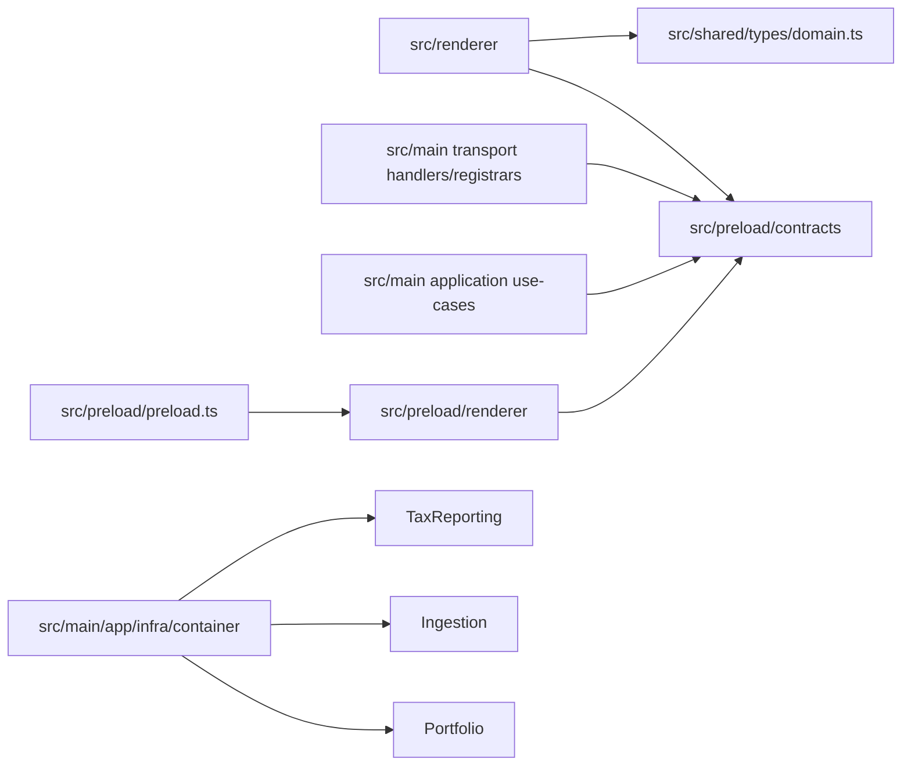

# Refactoring Analysis: DI Container and IPC API Boundary

> **Date**: 2026-05-05
> **Scope**: `src/main/app/infra/container`, `src/preload`, renderer imports of IPC/shared types, and backend use-cases that depend on IPC contracts
> **Analyzed by**: AI-assisted refactoring analysis (Martin Fowler's catalog)
> **Language/Stack**: TypeScript, Electron, React, Awilix, Zod
> **Test Coverage**: known — the analyzed areas have unit/integration tests, but composition-root refactoring still needs focused regression coverage

---

## Executive Summary

The highest-value refactoring is to break the global main-process composition root into context-level modules while keeping Awilix. Today one 244-line container file owns repositories, parsers, services, use cases, IPC registrars, and registry aggregation, which makes every cross-context change land in the same file.

The second structural problem is the public IPC boundary being mixed with preload runtime concerns and shared domain enums. `src/preload` currently acts as contracts package, renderer API package, main binding package, and Electron bridge at the same time. That shape leaks transport DTOs into backend use cases and leaks backend/domain enums into the renderer.

| Severity | Count |
|----------|-------|
| 🔴 Critical (P0) | 1 |
| 🟠 High (P1) | 3 |
| 🟡 Medium (P2) | 2 |
| 🔵 Low (P3) | 0 |
| **Total** | **6** |

### Top Opportunities (Quick Wins + High Impact)

| # | Finding | Location | Effort | Impact |
|---|---------|----------|--------|--------|
| 1 | Split the global composition root into context registries and remove the exported singleton container | `src/main/app/infra/container/index.ts:52` | moderate | Reduces divergent change, hidden dependencies, and cross-context merge pressure |
| 2 | Extract a dedicated IPC public API module and keep `src/preload` only as Electron bridge runtime | `src/preload/ipc/ipc-contract-registry.ts:1` | significant | Clarifies the renderer/main contract boundary and stops `src/preload` from being a mixed-responsibility package |
| 3 | Stop application use-cases from importing IPC contracts directly | `src/main/portfolio/application/use-cases/save-initial-balance-document.use-case.ts:1` | moderate | Restores transport-to-application separation and makes application DTOs independent from Electron IPC |

---

## Findings

### P0 — Critical

#### F1: Global Composition Root Has Become a Service-Locator Hub

- **Smell**: Large Module, Divergent Change
- **Category**: Change Preventer
- **Location**: `src/main/app/infra/container/index.ts:52-257`
- **Severity**: 🔴 Critical
- **Impact**: The same module owns every high-level wiring concern in the main process. Adding or changing a repository, parser, service, use case, registrar, or registry ordering all modify the same file. The `container.resolve(...)` calls inside registration also hide dependencies and make the composition root act like a service locator.

**Current Code** (simplified):
```ts
export interface AppCradle {
  brokerRepository: KnexBrokerRepository;
  importTransactionsUseCase: ImportTransactionsUseCase;
  portfolioIpcRegistrar: PortfolioIpcRegistrar;
  ipcRegistry: IpcRegistry;
}

export function registerDependencies(db: Knex) {
  container.register({
    importTransactionsUseCase: asFunction(
      () =>
        new ImportTransactionsUseCase(
          container.resolve('transactionParser'),
          container.resolve('assetRepository'),
          container.resolve('transactionRepository'),
          container.resolve('reallocateTransactionFeesService'),
          container.resolve('queue'),
        ),
    ).singleton(),
  });
}
```

**Recommended Refactoring**: Split Phase, Extract Module, Move Function

**After** (proposed):
```ts
export type MainBootstrap = {
  ipcRegistry: IpcRegistry;
};

export function createMainBootstrap(db: Knex): MainBootstrap {
  const container = createContainer({ injectionMode: InjectionMode.CLASSIC });

  registerSharedInfrastructure(container, db);
  registerPortfolioModule(container);
  registerIngestionModule(container);
  registerTaxReportingModule(container);
  registerAppModule(container);

  return { ipcRegistry: container.resolve('ipcRegistry') };
}
```

**Rationale**: The problem is not Awilix by itself. The problem is one file owning every registration decision plus local `resolve` calls that hide the true dependency graph. Context registries keep the framework but narrow the change surface and make ownership explicit.

---

### P1 — High

#### F2: `src/preload` Mixes Public API, Main Binding, Renderer API, and Electron Runtime

- **Smell**: Divergent Change, Shotgun Surgery
- **Category**: Change Preventer
- **Location**: `src/preload/ipc/ipc-contract-registry.ts:1-32`, `src/preload/renderer/electron-api.ts:1-114`, `src/preload/preload.ts:1-11`
- **Severity**: 🟠 High
- **Impact**: A single conceptual change to one IPC capability can force edits across contracts, renderer API typing, preload bridge, and main binders inside the same root package. This obscures which files are public API and which are Electron-only runtime details.

**Current Code** (simplified):
```ts
export const ipcContracts = [
  ...appIpcContracts,
  ...importIpcContracts,
  ...portfolioIpcContracts,
  ...reportIpcContracts,
  ...brokerIpcContracts,
  ...assetIpcContracts,
] as const;

export type ElectronApi = {
  listPositions: (input: ListPositionsQuery) => Promise<ListPositionsResult>;
  generateAssetsReport: (input: GenerateAssetsReportQuery) => Promise<GenerateAssetsReportResult>;
};
```

**Recommended Refactoring**: Extract Module, Introduce Public Facade

**After** (proposed):
```ts
// src/ipc/public/index.ts
export * from './contracts';
export type { RendererApi } from './renderer-api';

// src/preload/preload.ts
import { buildRendererApi, rendererContracts } from '../ipc/public';

const rendererApi = buildRendererApi(ipcRenderer, rendererContracts);
contextBridge.exposeInMainWorld('electronApi', rendererApi);
```

**Rationale**: IPC is the process boundary API. Treating it as a dedicated public module aligns it with HTTP-style controller DTO boundaries. `src/preload` should stay focused on the Electron bridge, not on owning the public API model.

---

#### F3: Application Use-Cases Depend on IPC DTOs

- **Smell**: Insider Trading
- **Category**: Coupler
- **Location**: `src/main/portfolio/application/use-cases/save-initial-balance-document.use-case.ts:1-39`, `src/main/ingestion/application/use-cases/preview-import.use-case.ts:6-31`
- **Severity**: 🟠 High
- **Impact**: Application services import transport-layer request/response types from IPC contracts. That means an API-shape change leaks directly into application code, and the application layer cannot evolve independently from Electron-facing concerns.

**Current Code** (simplified):
```ts
import type { SaveInitialBalanceDocumentCommand } from '../../../../preload/contracts/...';

export class SaveInitialBalanceDocumentUseCase {
  async execute(
    input: SaveInitialBalanceDocumentCommand,
  ): Promise<SaveInitialBalanceDocumentOutput> {
```

**Recommended Refactoring**: Change Function Declaration, Move Function Boundary

**After** (proposed):
```ts
export interface SaveInitialBalanceDocumentInput {
  ticker: string;
  year: number;
  assetType: AssetType;
  averagePrice: string;
  allocations: SaveInitialBalanceAllocationInput[];
}

export class SaveInitialBalanceDocumentUseCase {
  async execute(input: SaveInitialBalanceDocumentInput): Promise<SaveInitialBalanceDocumentOutput> {
```

**Rationale**: Use-cases should own application inputs and outputs. IPC handlers are the correct place to map public API DTOs into application models. This restores transport independence and respects the layered architecture rules already documented in the repository.

---

#### F4: Renderer Reaches Into Deep Contract Files and Shared Domain Enums

- **Smell**: Shotgun Surgery, Insider Trading
- **Category**: Coupler
- **Location**: `src/renderer/pages/ReportPage.tsx:3-7` and 15 other `window.electronApi` call sites; 47 files currently import `preload/contracts`; 94 files in the analyzed slice import `shared/types/domain`
- **Severity**: 🟠 High
- **Impact**: The renderer depends on deep file paths and on enums that originate from backend/shared internals. That makes the renderer a participant in backend type organization instead of a consumer of a stable public API.

**Current Code** (simplified):
```ts
import { ReportItemStatus, type AssetType } from '../../shared/types/domain';
import type { GenerateAssetsReportResult } from '../../preload/contracts/tax-reporting/assets-report.contract';
import type { AssetCatalogItem } from '../../preload/contracts/portfolio/assets.contract';
```

**Recommended Refactoring**: Hide Delegate, Introduce Public Facade

**After** (proposed):
```ts
import type {
  AssetCatalogItemDto,
  AssetTypeDto,
  GenerateAssetsReportResponse,
  ReportItemStatusDto,
} from '../../ipc/public';
```

**Rationale**: The renderer should consume one public boundary. A single import entrypoint prevents future layout changes in the IPC package from cascading through renderer pages, hooks, and tests.

---

### P2 — Medium

#### F5: `shared/types/domain.ts` Is a Heterogeneous Catch-All

- **Smell**: Large Module, Speculative Generality
- **Category**: Bloater
- **Location**: `src/shared/types/domain.ts:1-100`
- **Severity**: 🟡 Medium
- **Impact**: The file mixes backend-only concepts (`TransactionType`, `SourceType`), public-reporting concepts (`ReportItemStatus`, `PendingIssueCode`), and legacy UI-shaped data records (`Asset`, `Operation`). It no longer communicates a coherent ownership boundary.

**Current Code** (simplified):
```ts
export enum TransactionType { ... }
export enum SourceType { ... }
export enum ReportItemStatus { ... }
export type Asset = { ... }
export type Operation = { ... }
```

**Recommended Refactoring**: Extract Module, Remove Dead Code

**After** (proposed):
```ts
// src/main/... domain/application modules own internal enums
export enum TransactionType { ... }

// src/ipc/public contracts own process-boundary DTO enums
export type ReportItemStatusDto = 'required' | 'optional' | 'pending' | 'unsupported';
```

**Rationale**: "Shared" has become a fallback namespace. Splitting by ownership clarifies which concepts are internal business vocabulary and which belong to the public process boundary.

---

#### F6: `ElectronApi` Manually Mirrors Contract Signatures

- **Smell**: Duplicated Code
- **Category**: DRY Violation
- **Location**: `src/preload/renderer/electron-api.ts:1-114`
- **Severity**: 🟡 Medium
- **Impact**: The interface duplicates the contract surface one method at a time. Any contract rename, parameter change, or response change requires synchronized updates in the same public surface definition.

**Current Code** (simplified):
```ts
export type ElectronApi = {
  listAssets: (input?: ListAssetsQuery) => Promise<ListAssetsResult>;
  updateAsset: (input: UpdateAssetCommand) => Promise<UpdateAssetResult>;
  repairAssetType: (input: RepairAssetTypeCommand) => Promise<RepairAssetTypeResult>;
};
```

**Recommended Refactoring**: Extract Module, Replace Inline Code with Function Call

**After** (proposed):
```ts
export type RendererApi = ReturnType<typeof createRendererApiTypes>;

export const rendererContracts = defineRendererContracts([
  listAssetsContract,
  updateAssetContract,
  repairAssetTypeContract,
]);
```

**Rationale**: Even if some explicit typing remains, the public API should be driven from a single source of truth. Today the public surface is described in too many neighboring files.

---

## Coupling Analysis

### Module Dependency Map



### High-Risk Coupling

| Module | Afferent (dependents) | Efferent (dependencies) | Risk |
|--------|----------------------|------------------------|------|
| `src/main/app/infra/container/index.ts` | 2 direct runtime/test entrypoints, but it wires nearly every main component | cross-context repositories, services, use cases, IPC registrars, preload registry types | high |
| `src/shared/types/domain.ts` | 94 files in the analyzed slice import it | none | high |
| `src/preload/contracts/**` | 47 files in the analyzed slice import it | shared enums, zod helpers, IPC helpers | high |
| `src/preload/ipc/ipc-contract-registry.ts` | preload bridge and contract tests depend on it | six contract groups | medium |

### Circular Dependencies

None detected in the analyzed slice. A full automated cycle scan was not run.

---

## DRY Analysis

### Duplicated Code Clusters

| Cluster | Locations | Lines | Extraction Strategy |
|---------|-----------|-------|-------------------|
| Public renderer API signatures mirrored contract-by-contract | `src/preload/renderer/electron-api.ts:1-114`, `src/preload/ipc/ipc-contract-registry.ts:1-32` | ~140 | Derive the public renderer API from a single IPC public registry/facade |
| Transport DTOs reused as application DTOs | `src/main/portfolio/application/use-cases/save-initial-balance-document.use-case.ts:1-39`, `src/main/ingestion/application/use-cases/preview-import.use-case.ts:6-31` | ~65 | Introduce application-owned input/output types and map in handlers |

### Magic Values

| Value | Occurrences | Suggested Constant Name | Files |
|-------|-------------|------------------------|-------|
| `container.resolve(...)` as local service lookup pattern | 18+ in one file | not a constant; replace with constructor/local registration dependencies | `src/main/app/infra/container/index.ts` |
| Deep relative import prefix to IPC internals | widespread | not a constant; replace with public package entrypoints | `src/main/**`, `src/renderer/**`, `src/preload/**` |

### Repeated Patterns

The analyzed slice repeats the same pattern of deep importing individual contract files from both renderer and main code. It also repeats "shared enum as API enum" across public contracts, renderer components, and backend internals, which makes one semantic decision drive three ownership layers at once.

---

## SOLID Analysis

> **Context**: This project uses layered/clean-leaning architecture with bounded contexts, repositories, domain entities, value objects, and domain services. SOLID analysis is applicable.

| Principle | Finding | Location | Severity | Recommendation |
|-----------|---------|----------|----------|----------------|
| SRP | The app container owns all main-process composition concerns instead of only root bootstrap | `src/main/app/infra/container/index.ts` | critical | Split registration by context and keep the root as aggregator only |
| DIP | Application use-cases import IPC transport contracts directly | `src/main/portfolio/application/use-cases/save-initial-balance-document.use-case.ts:1`, `src/main/ingestion/application/use-cases/preview-import.use-case.ts:6` | high | Define application-owned DTOs and map at transport handlers |
| ISP | The renderer consumes deep internal contract files instead of a narrow public API surface | `src/renderer/**` | high | Publish a single renderer-facing IPC entrypoint |

---

## Suggested Refactoring Order

Recommended sequence based on impact, effort, and dependency between refactorings:

### Phase 1: Quick Wins (trivial effort, immediate clarity)
1. Create a dedicated IPC public entrypoint and redirect renderer imports to it — `src/ipc/public/**`
2. Extract the mixed contents of `shared/types/domain.ts` into ownership-based modules — `src/shared/types/domain.ts`

### Phase 2: High-Impact Structural Changes
1. Split the global container into context registration modules while keeping Awilix — `src/main/app/infra/container/index.ts`
2. Remove direct `container.resolve(...)` usage from local registration closures — `src/main/app/infra/container/index.ts`
3. Move transport/application DTO mapping into IPC handlers — `src/main/**/transport/**`, `src/main/**/application/use-cases/**`

### Phase 3: Deeper Architectural Improvements
1. Reduce `src/preload` to Electron bridge runtime only and move IPC infrastructure into a dedicated module — `src/preload/**`

### Prerequisites
- Add focused regression tests around main bootstrap, IPC contract exposure, and renderer API typing before deleting old entrypoints
- Do the new IPC public module before the container/module split so renderer/main imports have a stable target during migration

---

## Risks and Caveats

- Preserving channel names limits how much semantic cleanup can happen in one pass. The public API package should preserve current channels while changing file ownership only.
- The current container layout may feel convenient during small feature work; the report treats that convenience as a short-term gain with long-term coordination cost.
- Because many tests import old contract paths directly, a direct-cut migration will require coordinated test updates, not only production changes.
- No full dead-code sweep was run on `shared/types/domain.ts`; some legacy record types there may already be unused and should be verified before migration.

---

## Appendix: Smell Distribution

| Category | Count | % |
|----------|-------|---|
| Bloaters | 1 | 17% |
| Change Preventers | 2 | 33% |
| Dispensables | 0 | 0% |
| Couplers | 2 | 33% |
| Conditional Complexity | 0 | 0% |
| DRY Violations | 1 | 17% |
| SOLID Violations | 0 | 0% |
| **Total** | **6** | **100%** |
